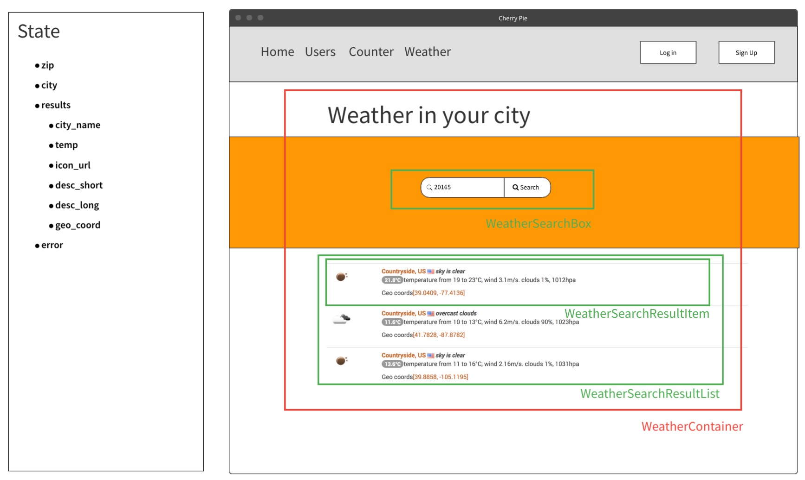

# Weather component
## Current weather data By ZIP code

- API - api.openweathermap.org/data/2.5/weather?zip={zip code},{country code}

## General
- [x] Env package for API key
- [x] Refactor routers to use React Router DOM
- [x] Move routes to a separate file
- [x] Refactor App component
  - [x] Integrate React Router with Redux
  - [x] Extract header navigation
  - [x] Nested routes
- [ ] Heroku env variable for API key

## Weather component
- [x] New route test
  - [x] New route
- [x] Selectors test
  - [x] Selectors
- [x] Reducer test
  - [x] Reducer
- [x] Actions test
  - [x] Actions
- [ ] Sagas test
  - [ ] Sagas
- [x] Container test
  - [x] Container
- [x] Component test
  - [x] Component

## Plan of action
- [ ] Create first component similar to https://openweathermap.org/find?q=20165
- [x] Design container/component - https://mockflow.com/app/#Wireframe

- [x] Create mock API
- [x] Write container tests
- [x] Create container code
- [x] Write component tests
- [x] Create components
- [x] Design state
  - zip
  - city
  - results
    - city_name
    - temp
    - icon_url
    - desc_short
    - desc_long
    - geo_coord
  - error
- [x] Selector test
  - [x] Selector
- [ ] Sagas test
  - [ ] Sagas
- [ ] Enhance components
- [ ] Real API
